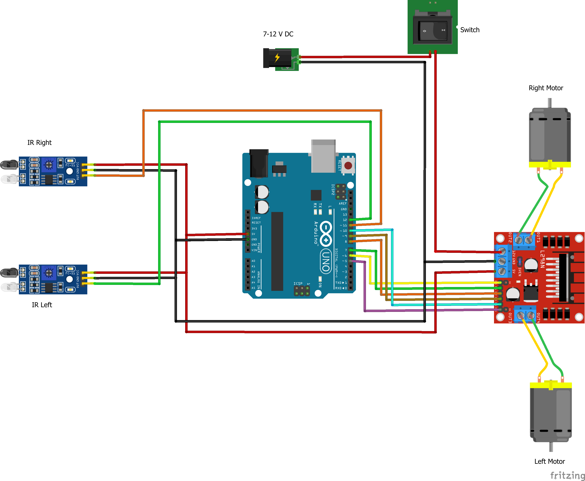

# Line Following Robot

A two-wheel line following robot built with an Arduino Uno, two IR sensors and an L298N motor driver. It follows a black line on a light surface and stops when both sensors see black.

> **Status:** Working prototype

## Components

| Component | Qty | Purpose |
|---|---|---|
| Arduino Uno | 1 | Main controller |
| L298N motor driver | 1 | Drives the two motors and supplies 5 V |
| FC-51 IR sensor module | 2 | Detect the line (left and right) |
| DC gear motors (TT type) | 2 | Drive the wheels |
| 3.7 V Li-ion cells | 2 | Power, wired in series (about 7.4 V) |
| Rocker switch | 1 | Main power switch |
| Chassis, wheels, caster, wires | - | Body of the robot |

## Circuit



### Pin connections

| Arduino pin | Connected to |
|---|---|
| 12 | Left IR sensor OUT |
| 11 | Right IR sensor OUT |
| 6 | L298N ENA (right motor speed, PWM) |
| 7 | L298N IN1 (right motor direction) |
| 8 | L298N IN2 (right motor direction) |
| 5 | L298N ENB (left motor speed, PWM) |
| 9 | L298N IN3 (left motor direction) |
| 10 | L298N IN4 (left motor direction) |

### Power

- Two 3.7 V Li-ion cells in series give about 7.4 V, which feeds the L298N 12 V terminal through the switch.
- The L298N's onboard 5 V regulator powers the Arduino and both IR sensors, so a single battery pack and a single switch run the whole robot.
- All grounds (battery, L298N, Arduino, sensors) are connected together.

## How it works

Each IR sensor outputs HIGH over a black surface and LOW over a light surface. The Arduino reads both sensors in a loop and decides the motion:

| Left sensor | Right sensor | Action |
|---|---|---|
| Light | Light | Move forward (the line is between the sensors) |
| Light | Black | Turn right (right motor reverses, left motor forwards) |
| Black | Light | Turn left (left motor reverses, right motor forwards) |
| Black | Black | Stop |

Motor speed is fixed at `180` out of 255 using PWM on the enable pins.

### A detail worth noting: PWM frequency

TT gear motors often do not turn at low PWM values, and at higher values they run too fast to follow the line. To fix this, the code raises the PWM frequency on pins 5 and 6 to about 7.8 kHz by changing the Timer0 prescaler:

```cpp
TCCR0B = TCCR0B & B11111000 | B00000010;
```

This makes the motors run smoothly at controlled speed. Because this changes Timer0, `delay()` and `millis()` run faster than normal, which is fine here since the code does not use them.

## Code

The full sketch is in [`code/LineFollowerRobot.ino`](code/LineFollowerRobot.ino).

To run it:

1. Open the file in the Arduino IDE.
2. Select **Board: Arduino Uno** and the correct port.
3. Upload.
4. Place the robot on the line, switch on the battery, and it starts moving.

## Challenges and what I learned

- [Write 2 or 3 real points here. Examples: calibrating the IR sensor potentiometer for the surface, motors not turning at low PWM, one motor running faster than the other.]

## Possible improvements

- Replace the on/off turning with PID control for smoother, faster line following
- Add more sensors (a 5-sensor array) to handle sharp turns and intersections
- Add a speed-based turn instead of spinning on the spot

## Credits

[If you based the logic on a tutorial or open-source example, credit it here with a link. For example: "Based on a public tutorial (link here), modified for my chassis and pin setup."]
